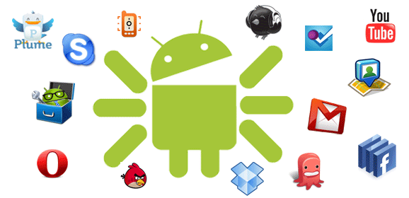
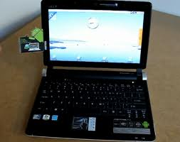

===============
Características
===============

* Código abierto.
* Núcleo basado en el Kernel de Linux.
* Adaptable a muchas pantallas y resoluciones.
* Utiliza `SQLite <#>`_ para el almacenamiento de datos.
* Ofrece diferentes formas de mensajería.
* Navegador web basado en `WebKit <#>`_ incluido.
* Soporte de Java y muchos formatos multimedia.
* Soporte de HTML, HTML5, Adobe Flash Player, etc.
* Incluye un emulador de dispositivos, herramientas para depuración de memoria y análisis del rendimiento del software.
* Catálogo de aplicaciones gratuitas o pagas en el que pueden ser descargadas e instaladas (Google Play).
* Bluetooth.
* Google Talk desde su versión HoneyComb, para realizar videollamadas.
* Multitarea real de aplicaciones.

Arquitectura
============

.. image:: imagenes/arquitectura.jpg
    :scale: 75 %
    :align: center
    

* :Aplicaciones: incluyen un cliente de correo electrónico, programa de SMS, calendario, mapas, navegador, contactos y otros. Todas ellas escritas en Java.

* :Marco de trabajo de aplicaciones: los desarrolladores tienen acceso completo a los mismos APIs del framework usados por las aplicaciones base. La arquitectura está diseñada para simplificar la reutilización de componentes; cualquier aplicación puede publicar sus capacidades y cualquier otra aplicación puede luego hacer uso de esas capacidades.

* :Bibliotecas: incluye un conjunto de bibliotecas de C/C++ usadas por varios componentes del sistema.

* :Runtime de Android: incluye un set de bibliotecas base que proporcionan la mayor parte de las funciones disponibles en las bibliotecas base del lenguaje Java. Cada aplicación Android corre su propio proceso, con su propia instancia de la `máquina virtual Dalvik <#Maquina virtual Dalvik>`_.

* :Núcleo Linux: Android depende de Linux para los servicios base del sistema como seguridad, gestión de memoria, gestión de procesos, pila de red y modelo de controladores. También actúa como capa de abstracción entre el hardware y el resto de la pila de software.

Android x86
-----------

La plataforma de hardware principal de Android es la arquitectura ARM.

Hay soporte para x86 en el proyecto Android-x86, que surgió de la idea de poder integrar Android en cualquier tipo de hardware, por lo que decidieron adaptarlo para funcionar en arquitectura x86, de esta maner podemos correr cualquier versión de Android en la PC de nuestra casa.

Aplicaciones en Android
=======================

La estructura del sistema operativo Android se compone de aplicaciones que se ejecutan en un framework Java de aplicaciones orientadas a objetos sobre el núcleo de las bibliotecas de Java en una máquina virtual Dalvik con compilación en tiempo de ejecución.

Las bibliotecas escritas en lenguaje C incluyen un administrador de interfaz gráfica (surface manager), un framework OpenCore, una base de datos relacional SQLite, una Interfaz de programación de API gráfica OpenGL ES 2.0 3D, un motor de renderizado WebKit, un motor gráfico SGL, SSL y una biblioteca estándar de C Bionic.

.. topic:: Curiosidad:
    
    El sistema operativo está compuesto por 12 millones de líneas de código, incluyendo 3 millones de líneas de XML, 2,8 millones de líneas de lenguaje C, 2,1 millones de líneas de Java y 1,75 millones de líneas de C++.

Dalvik
------

Uno de los elementos clave de Android es la **máquina virtual de Dalvik**. 

.. note:: En lugar de utilizar una tradicional máquina virtual Java (VM), tales como Java ME (Java Mobile Edition), Android utiliza su propia máquina virtual personalizado diseñado para asegurar que la multitarea se ejecuta de manera eficiente en un único dispositivo.

Todo el hardware de Android y acceso a los servicios del sistema se gestiona mediante Dalvik como un nivel intermedio. 

Mediante el uso de una máquina virtual para organizar la ejecución de aplicaciones, los desarrolladores tienen una capa de abstracción que asegura que nunca tendrán que preocuparse de una aplicación de hardware en particular.

