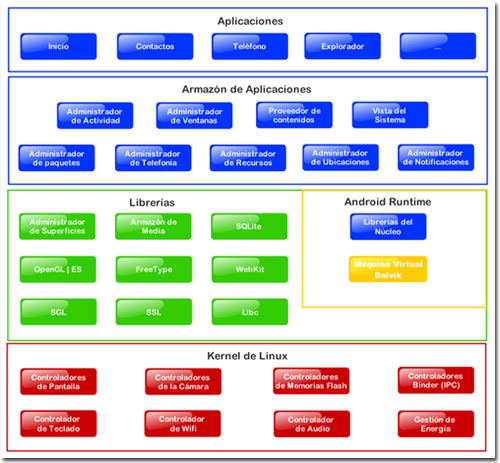

===============
Características
===============

* Código abierto.
* Núcleo basado en el Kernel de Linux.
* Adaptable a muchas pantallas y resoluciones.
* Utiliza `SQLite <#>`_ para el almacenamiento de datos.
* Ofrece diferentes formas de mensajería.
* Navegador web basado en ̣`WebKit <#>`_ incluido.
* Soporte de Java y muchos formatos multimedia.
* Soporte de HTML, HTML5, Adobe Flash Player, etc.
* Incluye un emulador de dispositivos, herramientas para depuración de memoria y análisis del rendimiento del software.
* Catálogo de aplicaciones gratuitas o pagas en el que pueden ser descargadas e instaladas (Google Play).
* Bluetooth.
* Google Talk desde su versión HoneyComb, para realizar videollamadas.
* Multitarea real de aplicaciones.

Arquitectura
============

    

* :Aplicaciones: incluyen un cliente de correo electrónico, programa de SMS, calendario, mapas, navegador, contactos y otros. Todas ellas escritas en Java.

* :Marco de trabajo de aplicaciones: los desarrolladores tienen acceso completo a los mismos APIs del framework usados por las aplicaciones base. La arquitectura está diseñada para simplificar la reutilización de componentes; cualquier aplicación puede publicar sus capacidades y cualquier otra aplicación puede luego hacer uso de esas capacidades.

* :Bibliotecas: incluye un conjunto de bibliotecas de C/C++ usadas por varios componentes del sistema.

* :Runtime de Android: incluye un set de bibliotecas base que proporcionan la mayor parte de las funciones disponibles en las bibliotecas base del lenguaje Java. Cada aplicación Android corre su propio proceso, con su propia instancia de la `máquina virtual Dalvik <#>`_.

* :Núcleo Linux: Android depende de Linux para los servicios base del sistema como seguridad, gestión de memoria, gestión de procesos, pila de red y modelo de controladores. También actúa como capa de abstracción entre el hardware y el resto de la pila de software.
