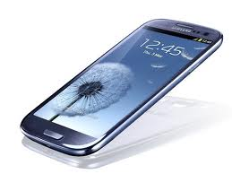
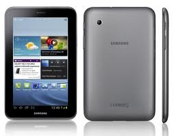

========
Glosario
========

Middleware
==========

Middleware es un software que asiste a una aplicación para interactuar o comunicarse con otras aplicaciones, software, redes, hardware y/o sistemas operativos. Éste simplifica el trabajo de los programadores en la compleja tarea de generar las conexiones que son necesarias en los sistemas distribuidos. De esta forma se provee una solución que mejora la calidad de servicio, seguridad, envío de mensajes, directorio de servicio, etc.

Para más información:
(http://es.wikipedia.org/wiki/Middleware)

Open Handset Alliance
=====================

Conglomerado formado por casi 100 compañías relacionadas con la tecnología móvil y dispositivos móviles; dirigido por Google.

Entre ellas están: Texas Instruments, Broadcom Corporation, Nvidia, Qualcomm, Samsung Electronics, Sprint Nextel, Intel, LG, Marvell Technology Group, Motorola y T-Mobile.

Para más información:
(http://www.openhandsetalliance.com/)

SQLite
======

Un motor de bases de datos relacionales de gran alcance y ligero disponible para todas las aplicaciones.

WebKit
======

WebKit es una plataforma para aplicaciones que funciona como base para el navegador web Safari, Google Chrome, Epiphany, Maxthon, Midori,Qupzilla entre otros. Está basado originalmente en el motor de renderizado KHTML del navegador web del proyecto KDE, Konqueror.

Para más información:
(http://es.wikipedia.org/wiki/WebKit)

Smartphones
===========

Es un teléfono móvil construido sobre una plataforma informática móvil, con una mayor capacidad de computación y conectividad que un teléfono móvil convencional. 

El término inteligente hace referencia a la capacidad de usarse como un computador de bolsillo, llegando incluso a remplazar a un computador personal en algunos casos.

Tablets
=======

Es un tipo de computadora portátil, de mayor tamaño que un teléfono inteligente o una PDA, integrado en una pantalla táctil (sencilla o multitáctil) con la que se interactúa primariamente con los dedos o una pluma stylus (pasiva o activa), sin necesidad de teclado físico ni ratón. 

Estos últimos se ven reemplazados por un teclado virtual y, en determinados modelos, por una mini-trackball integrada en uno de los bordes de la pantalla. Hoy en día son muy usados como agenda electrónica y también para trabajo, ya que uno puede leer archivos de PDF, .txt, etc, y también editar documentos.
