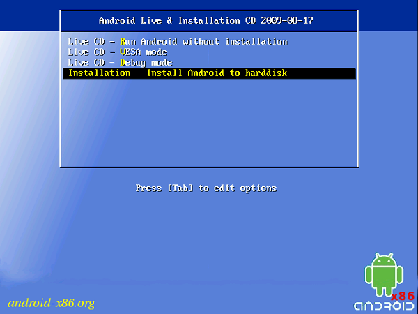
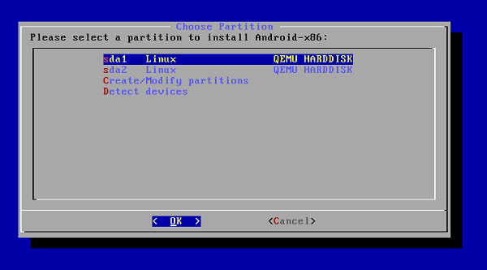
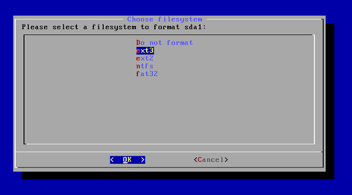
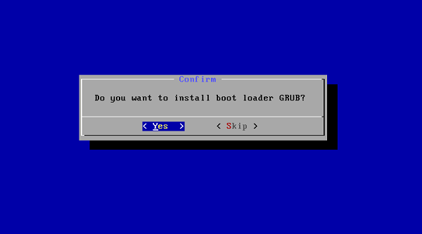
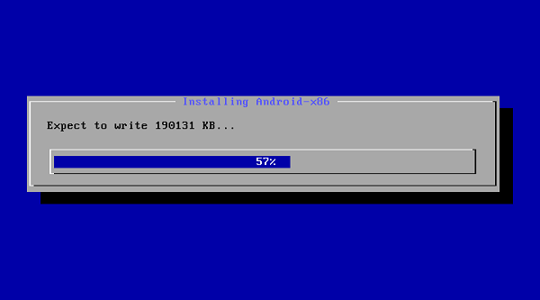
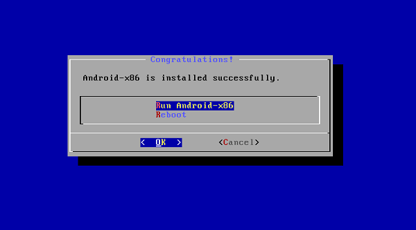

===========
Instalación
===========

Instalación de Android para PC
==============================

Gracias a un reciente lanzamiento de la versión Android X86 puedes instalarlo en tu computadora, tal cual viene por defecto en algunas notebooks actualmente.

Primeros pasos con Android para PC
----------------------------------

Una vez que hayas descargado el instalador, encontrarás un archivo ISO en tu escritorio o ruta elegida en la descarga. Como siempre, en la manipulación de estas imágenes de disco lo mejor es utilizar un DVD o CD, como en este caso, y grabar bajo la opción de "usar imagen" con tu programa preferido. Existe también la posibilidad de extraer el contenido en una llave USB, pero no nos centraremos en ese proceso aquí.

Iniciaremos el equipo con el CD dentro de la lectora y se ejecutará automáticamente el siguiente menú de instalación. Podrás ver que existen 4 opciones distintas, la que nos interés a nosotros en este tutorial es la cuarta: "Install Android to hard disk".

.. note:: En caso de querer probar Android sin instalar (modo Live), puedes optar por la primera opción "Run Android without installation". En esa opción deberás seguir las opciones que se te indiquen.

Selección de la partición
-------------------------

Como lo que estamos por instalar es un sistema operativo, como lo es Windows, debemos hacerlo en un espacio distinto al que estamos utilizando para el actual,es decir, emplearemos un espacio aparte en el disco duro conocido como partición. Para no complicar la creación de estos espacios en el disco duro, sigue los pasos detallados a continuación.

En la siguiente pantalla, el proceso nos mostrará las distintas particiones de disco disponibles. Debes seleccionar la que dice: "**sda1 Linux…**", en caso de no poseerla deberás crearla a través de la tercera opción: **Create/Modify partitions**.

A partir de este momento el proceso es sumamente veloz y muy sencillo. La instalación puede parecer algo anticuada pero no te preocupes, es completamente estable, sin fallos ni errores de ningún tipo.

Ahora se nos preguntará **qué tipo de formato usará la partición sda1** seleccionada en el paso previo, por lo que escogeremos **ext3**, tal cual se muestra.

Seguimos con la opción del menú de arranque, en este paso es muy importante seleccionar YES, ya que esto permitirá elegir entre **iniciar Windows o Android** apenas enciendas la computadora luego que hayas completado el proceso.

Simplicidad sobre todas las cosas
---------------------------------

Listo, lo más difícil ha pasado y dará lugar a la descompresión de archivos de sistema, creación de los componentes y todo lo necesario para que Android funcione correctamente. Verás la clásica carga porcentual, como se muestra en la próxima captura.

Al finalizar la instalación, se nos brindará la opción de reiniciar el equipo o de iniciar directamente el maravilloso sistema operativo. En esta cuarta versión, denominada Ice Cream Sandwich, se han corregido numerosos errores que arrastraba la entrega 2.3, por lo cual podrás acceder al Market y a todas las aplicaciones que necesites.

Instalación de Android en Máquina virtual
=========================================

Para instalar Android en una máquina virtual "VirtualBox", visitá el siguiente tutorial:

* http://www.softwarelibre.ulpgc.es/node/181
