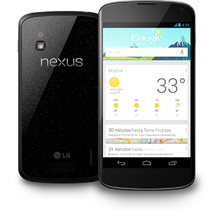
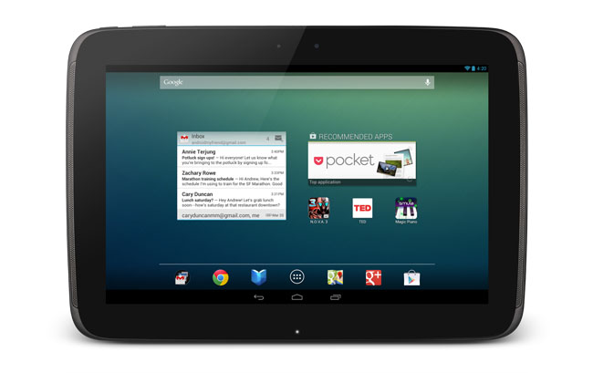

==========
Terminales
==========

Familia Nexus
=============

La familia NEXUS es una gama de dispositivos móviles diseñados por Google con el único propósito de ofrecer una experiencia “pura” de Android, es decir, el software de Android de una forma pura, sin agregados de las compañías que los venden y/o producen. 

Estos dispositivos saben ser de un rendimiento excepcional frente a sus rivales. Uno de ellos fue elegido como el mejor dispositivo para desarrollo de software de Android. Nexus ha diseñado `smartphones <https://androidos.readthedocs.org/en/latest/data/glosario/#smartphones>`_, `tablets <https://androidos.readthedocs.org/en/latest/data/glosario/#tablets>`_ y un reproductor multimedia. Estos son:

Smartphones
-----------

Nexus One
*********

* Fabricado por HTC y disponible desde enero de 2010.
* Android 2.0 actualizable a 2.3.
* Microprocesador de 1GHz con una RAM de 512 Mb.
* Capacidad interna de 512 Mb.

Nexus S
*******

* Fabricado por Samsung.
* Android 2.3 Ginger Bread con NFC (Near Field Communication), actualizable a 4.1 Jelly Bean.
* Microprocesador de 1GHz con una RAM de 512 Mb
* El microprocesador tiene conjuntos de instrucciones que hacen que su rendimiento sea mucho mayor, además de ser acompañado por su gran procesador gráfico.
* Capacidad interna de 16 GB.

Galaxy Nexus
************

* Fabricado por Samsung.
* Microprocesador doble núcleo de 1,2 GHz cada uno, RAM de 1GB.
* Memoria interna de 16/32 GB (no ampliable).
* Android 4.0 actualizable a 4.1.

Nexus 4
*******

* Fabricado por LG.
* Procesador Snapdragon S4 Pro de cuatro núcleos de 1,5 GHz.
* Memoria RAM es de 2GB.
* GPU Adreno 320, capaz de mover cualquier juego actual de Android y más.
* Espacio de almacenamiento de 8 ó 16 GB.
* Android 4.2.

Tablets
-------

Nexus 7
*******

* 7 pulgadas.
* Desarrollada con Asus.
* Android 4.1.
* Diseñada para aprovechar el contenido disponible a través de Google Play.
* Su punto de factor de forma y el precio también lo pone en competencia directa con dispositivos como el Kindle Fire (que se ejecuta una versión bifurcada de Android).

Nexus 10
********

    
    
* Fabricado por Samsung.
* Procesador Samsung Exynos 5250 de 1.7GHz basado en la arquitectura ARM Córtex A15 de dos núcleos.
* Memoria RAM de 2GB.
* Almacenamiento interno de 16 o 32 GB.

.. image:: http://i.creativecommons.org/l/by-sa/3.0/88x31.png
    :align: center

Esta página (por `Alumnos del ITS Villada <https://github.com/LuchoCastillo/AndroidOS/>`_) se encuentra bajo una `Licencia Creative Commons Atribución-CompartirIgual 3.0 Unported <http://creativecommons.org/licenses/by-sa/3.0/deed.es>`_.